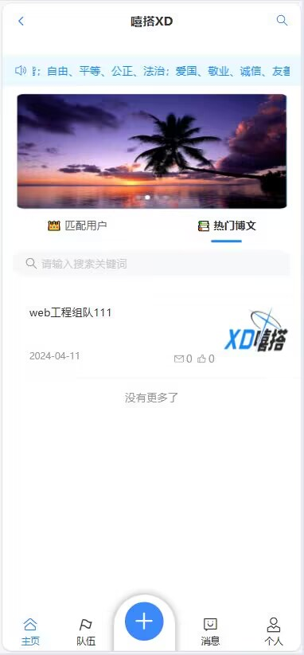
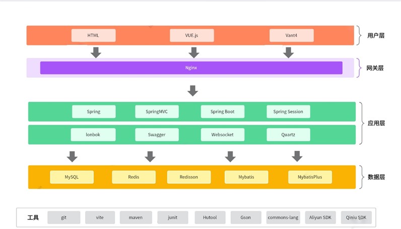

# XD嘻搭——Web应用设计

## 一、交互设计

1. ### **用户登录和注册**：
   
   - 提供用户登录和注册功能，登录后可以访问个人主页和其他功能。
   - 注册时需要填写手机号并验证，成功后可设置个性化标签。
2. ### **个人主页**：
   
   - 用户登录后可访问个人主页，展示用户创建的队伍、加入的队伍、创建的帖文等信息。
   - 提供修改个人信息的功能，包括头像、昵称、标签、个性签名、性别、电话和邮箱等。
3. ### **搜索用户和队伍**：
   
   - 提供搜索功能，可以通过标签搜索用户，通过队伍名搜索队伍。
4. ### **队伍交互功能**：
   
   - 用户可以创建队伍，设置队伍过期时间和访问权限。
   - 队长和管理员可以更新队伍信息，解散队伍。
   - 提供队伍聊天室，成员可以进行实时聊天。
5. ### **博文交互功能**：
   
   - 用户可以创建博文，发布到热门帖文中。
   - 其他用户可以对博文进行点赞、评论和举报。
   - 提供消息中心，展示新消息提醒、关注更新、评论点赞等信息。


## 二、展示设计

- ### 线框


- ### 页面布局形式

框架型布局——上下框架型


- ### 页面布局技术

DIV + CSS


- ### 主页布局设计





- ### 页面元素设计

LOGO


- ### 展示设计工具

Dreamweaver


## 三、内容设计

- ### 架构方法

从上到下的架构方法


- ### 组织机制

线性结构 + 层次结构 + 矩阵结构

线性结构：添加博文 -> 添加图片 -> 填写标题 -> 添加正文 -> 发布

层次结构：队伍 -> 队伍名 -> 队伍成员

矩阵结构：按照队名搜索队伍


- ### 导航机制

底部导航：主页 + 队伍 + 添加博文 + 消息 + 个人


- ### 搜索机制

主页匹配用户：搜索用户的用户名或标签

队伍：搜索队伍


## 四、功能设计

- ### 技术栈：

Vue 3 + Vite 脚手架 + Vant UI 移动端组件库 + Axios 请求库


- ### 软件架构

  

- ### 前端结构

```  structure
  .
    |-- index.html
    |-- public
    |-- src
    |   |-- App.vue
    |   |-- main.ts
    |   |-- components
    |   |   |-- BlogCardList.vue
    |   |   |-- CommentList.vue
    |   |   |-- MessageDefalutGrid.vue
    |   |   |-- MessageList.vue
    |   |   |-- TeamCardList.vue
    |   |   |-- TeamMemberCardList.vue
    |   |   |-- UserCardList.vue
    |   |   |-- UserCommentList.vue
    |   |   |-- UserLikeList.vue
    |   |-- config
    |   |   |-- routes.ts
    |   |-- constants
    |   |   |-- team.ts
    |   |-- layouts
    |   |   |-- BasicLayout.vue
    |   |-- models
    |   |   |-- blog.d.ts
    |   |   |-- comment.d.ts
    |   |   |-- like.d.ts
    |   |   |-- team.d.ts
    |   |   |-- user.d.ts
    |   |-- pages
    |   |   |-- AfterSignUp.vue    
    |   |   |-- BlogEditPage.vue
    |   |   |-- BlogPage.vue
    |   |   |-- ChatPage.vue
    |   |   |-- ForgetPasswordPage.vue
    |   |   |-- Index.vue
    |   |   |-- MassagePage.vue
    |   |   |-- SearchPage.vue
    |   |   |-- SearchResultPage.vue
    |   |   |-- SignUpPage.vue
    |   |   |-- TeamAddPage.vue
    |   |   |-- TeamDetailPage.vue
    |   |   |-- TeamPage.vue
    |   |   |-- TeamUpdatePage.vue
    |   |   |-- UpdatePasswordPage.vue
    |   |   |-- UserBlogCommentPage.vue
    |   |   |-- UserBlogPage.vue
    |   |   |-- UserDetailPage.vue
    |   |   |-- UserEditPage.vue
    |   |   |-- UserFansPage.vue
    |   |   |-- UserFollowedBlogPage.vue
    |   |   |-- UserFollowPage.vue
    |   |   |-- UserLikePage.vue
    |   |   |-- UserLoginPage.vue
    |   |   |-- UserPage.vue
    |   |   |-- UserTagPage.vue
    |   |   |-- UserTeamCreatePage.vue
    |   |   |-- UserTeamJoinPage.vue
    |   |   |-- UserUpdatePage.vue
    |   |-- plugins
    |   |   |-- my-axios.js
    |   |-- services(已弃用)
    |   |   |-- user.ts(已弃用)
    |   |-- status(已弃用)
    |       |-- user.ts(已弃用)
    |
    |-- package.json```
```


